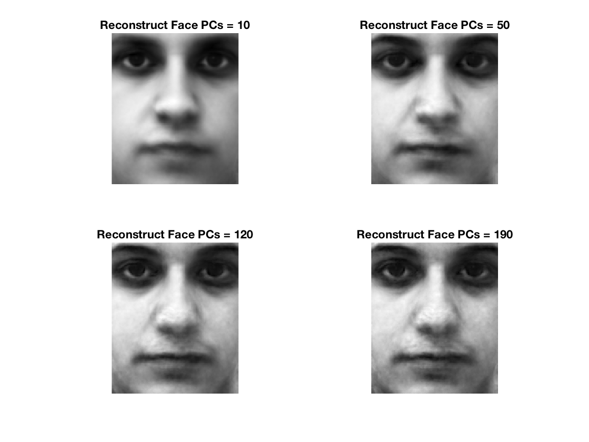

### Face-Recognition-Using-Principal-Component-Analysis

___

#### (a)  Compute the principal components (PCs) using first 190 individuals’ neutral expression image 

In the first, reshape the matrix images to vectors and construct a larger matrix that contain all 190 images' information. After subtract the mean, we have the covariance matrix. Then use `eig(cov'*cov)` to get the eigenvector and eigenvalue. Finally, we have the normalized eigenfaces matrix by using `eig_face = normc(cov * eig_vec)`

With the eigenfaces matrix, we can extract particular number of PCs to reconstruct images.

#### (b)  Reconstruct one of 190 individuals’ neutral expression image using different number of PCs 

To reconstruct the image, we use this formula : 

`test_face_vec = eigen_face*eigen_face'*(test_face_vec - mean_face) + mean_face` 

This is the origin image:

Here are results

As you can see, with the increase of PCs, the result become more and more similar to the origin face.

#### (c)  Reconstruct one of 190 individuals’ smiling expression image using different number of PCs 

Just like the part (b), with the increase of PCs, the result becomes more and more similar to the origin face. Almost when PCs very large, can we see the "Smiling Face". It may because the training set we use the "neutral expression"

#### (d)  Reconstruct one of the other 10 individuals’ neutral expression image using different number of PCs 

Even the test image is not belongs to the training set, when PCs is large, the result is still similar with the origin image. But if comparing with part (b), it shows less precision.

#### (e)  Use other non-human image and try to reconstruct it using all PCs. 

As you can see, when I try to reconstruct a non-human image, the result still shows little trace of "human". But it is really different from the origin face. It is because we used the "human faces "  as the training sample. It is hard to reconstruct a "non-human face".

#### (f)  Rotate one of 190 individuals’ neutral expression image with different degrees and try to reconstruct it using all PCs 

When the rotation angle increase, the result becomes really bad. It means that even we just rotate a "human face", it really affect the precision of reconstruction.