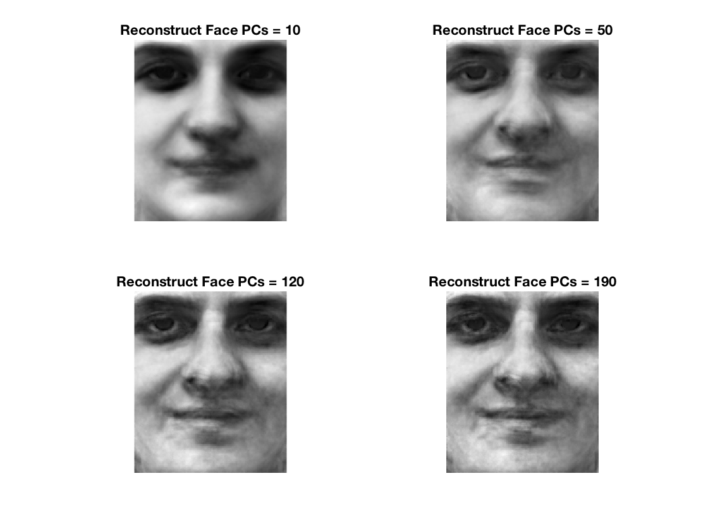
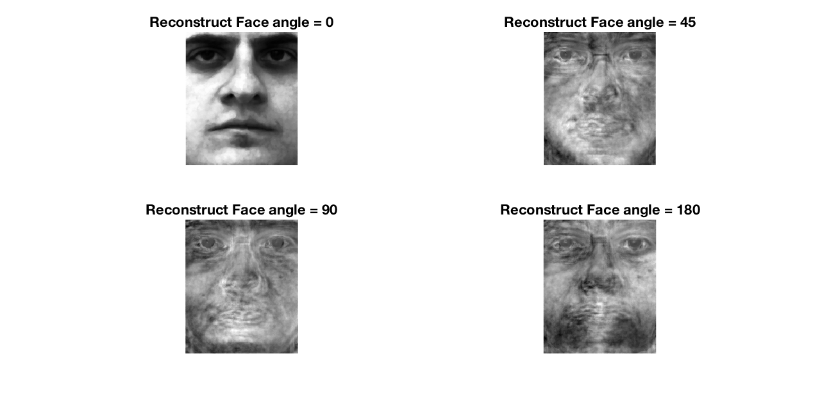

### Face-Recognition-Using-Principal-Component-Analysis

___

#### (a)  Compute the principal components (PCs) using first 190 individuals’ neutral expression image 

In the first, reshape the matrix images to vectors and construct a larger matrix that contain all 190 images' information. After subtract the mean, we have the covariance matrix. Then use `eig(cov'*cov)` to get the eigenvector and eigenvalue. Finally, we have the normalized eigenfaces matrix by using `eig_face = normc(cov * eig_vec)`

With the eigenfaces matrix, we can extract particular number of PCs to reconstruct images. One thing worth mentioned is that I reversed the eigenface matrix so that the columns will be in decreasing sort. In that case, I only have to pick the first N columns of eigenface matrix to get the particular number of PCs.

#### (b)  Reconstruct one of 190 individuals’ neutral expression image using different number of PCs 

To reconstruct the image, we use this formula : 

`test_face_vec = eigen_face*eigen_face'*(test_face_vec - mean_face) + mean_face` 

This is the origin image:


Here are results


As you can see, with the increase of PCs, the result become more and more similar to the origin face. When the PCs becomes really large, the result is very close to the origin face.

#### (c)  Reconstruct one of 190 individuals’ smiling expression image using different number of PCs 




Just like the part (b), with the increase of PCs, the result becomes more and more similar to the origin face. Even when PCs is small, we still see the a little trace of "Smiling Face". It means even though we use the "neutral expression" to be the training sample, we can also use the PCs to reconstruct some information of the test sample. 

#### (d)  Reconstruct one of the other 10 individuals’ neutral expression image using different number of PCs 


Even the test image is not belongs to the training set, when PCs is large, the result is still similar with the origin image. When the PCs reached some scale(120), the precision do not increase too much. Moreover, if compared with part (b), it shows less precision.

#### (e)  Use other non-human image and try to reconstruct it using all PCs. 


As you can see, when I try to reconstruct a non-human image, the result still shows little trace of "human". But it is really different from the origin face. It is because we used the "human faces "  as the training sample. It is hard to reconstruct a "non-human face".

#### (f)  Rotate one of 190 individuals’ neutral expression image with different degrees and try to reconstruct it using all PCs 



When the rotation angle increase, the result becomes really bad. It means that even we just rotate a "human face", it really affect the precision of reconstruction.

___

### Resource Code

###### main.m

```matlab
clc;
clear;
global mean_face eig_face row col path;
row = 193;
col = 162;
N = 190;
path = './facedata/';
% Compute the principal components %
t_set = zeros(row*col, N);
for i = 1:N
    path_face = [path, mat2str(i), 'a.jpg'];
    img = imread(path_face);
    t_set(:,i) = reshape(img,row*col,1);
end
mean_face = mean(t_set,2);
cov = t_set - mean_face;
[eig_vec, eig_val] = eig(cov'*cov);
% [~, index] = sort(abs(diag(eig_val)));
eig_face = fliplr(normc(cov * eig_vec));

% Reconstruct one of 190 individuals? neutral expression image %
figure;
subplot(2,2,1);
reconstruct(1,'a',10);
subplot(2,2,2);
reconstruct(1,'a',50);
subplot(2,2,3);
reconstruct(1,'a',120);
subplot(2,2,4);
reconstruct(1,'a',190);
% Reconstruct one of 190 individuals? smiling expression image %
figure;
subplot(2,2,1);
reconstruct(1,'b',10);
subplot(2,2,2);
reconstruct(1,'b',50);
subplot(2,2,3);
reconstruct(1,'b',120);
subplot(2,2,4);
reconstruct(1,'b',190);
% Reconstruct one of the other 10 individuals? neutral expression image %
figure;
subplot(2,2,1);
reconstruct(200,'a',10);
subplot(2,2,2);
reconstruct(200,'a',50);
subplot(2,2,3);
reconstruct(200,'a',120);
subplot(2,2,4);
reconstruct(200,'a',190);
% Use other non-human image %
figure;
subplot(1,2,1);
path_face = [path,'777a.jpg'];
I = imread(path_face);
imshow(I);
title('Origin Image');
subplot(1,2,2);
reconstruct(777,'a',190);
% Rotate one of 190 individuals? neutral expression 
% image with different degrees 
path_face = [path,'1a.jpg'];
I = imread(path_face);
angle = [0, 45, 90, 180];
figure;
for i = 1:4
test_face = imrotate(I, angle(i), 'crop');
test_face_vec = reshape(test_face,row*col,1);
test_face_vec = double(test_face_vec);
test_face_vec = eig_face*eig_face'*(test_face_vec - mean_face) + mean_face;
res_face = reshape(test_face_vec,row,col);

subplot(2,2,i);
imshow(mat2gray(res_face));
title(['Reconstruct Face angle = ', mat2str(angle(i))]);
end
```

###### reconstruct.m

```matlab
function [] = reconstruct(n,type,pca_n)
global mean_face eig_face row col path;
ef = eig_face(:,1:pca_n);
path_face = [path, mat2str(n), type,'.jpg'];
test_face = imread(path_face);
test_face_vec = reshape(test_face,row*col,1);
test_face_vec = double(test_face_vec);
test_face_vec = ef*ef'*(test_face_vec - mean_face) + mean_face;
res_face = reshape(test_face_vec,row,col);
imshow(mat2gray(res_face));
title(['Reconstruct Face PCs = ', mat2str(pca_n)]);
end
```

